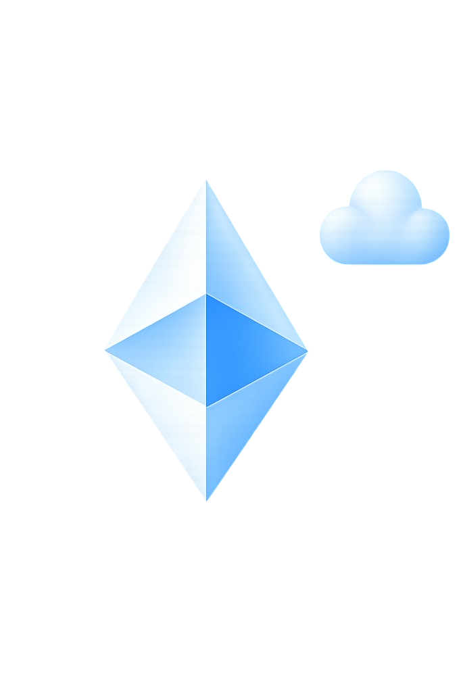

  

  <b>Offensive Security Researcher &amp; Systems Engineer</b>

 

  

 

### 👽 Focus Areas

  
  
   
  
  

 

### 🫠 Independent Products

  
  &nbsp;&nbsp;&nbsp;
  
  &nbsp;&nbsp;&nbsp;
  

<table align="center">
  <tr>
    <td align="center"><b><a href="https://github.com/kiurakku/shok-monitor">Shok Monitor</a></b></td>
    <td align="center"><b><a href="https://github.com/kiurakku/umbrella-wallet">Umbrella Wallet</a></b></td>
    <td align="center"><b>Granite</b></td>
  </tr>
  <tr>
    <td align="center">open-source VPS/server monitoring</td>
    <td align="center">crypto wallet project</td>
    <td align="center">development platform</td>
  </tr>
</table>

 

### 😶‍🌫️ Core Skills

  
  &nbsp;&nbsp;&nbsp;&nbsp;&nbsp;
  

 

  Open to opportunities — see pinned repos for recent work.

  

